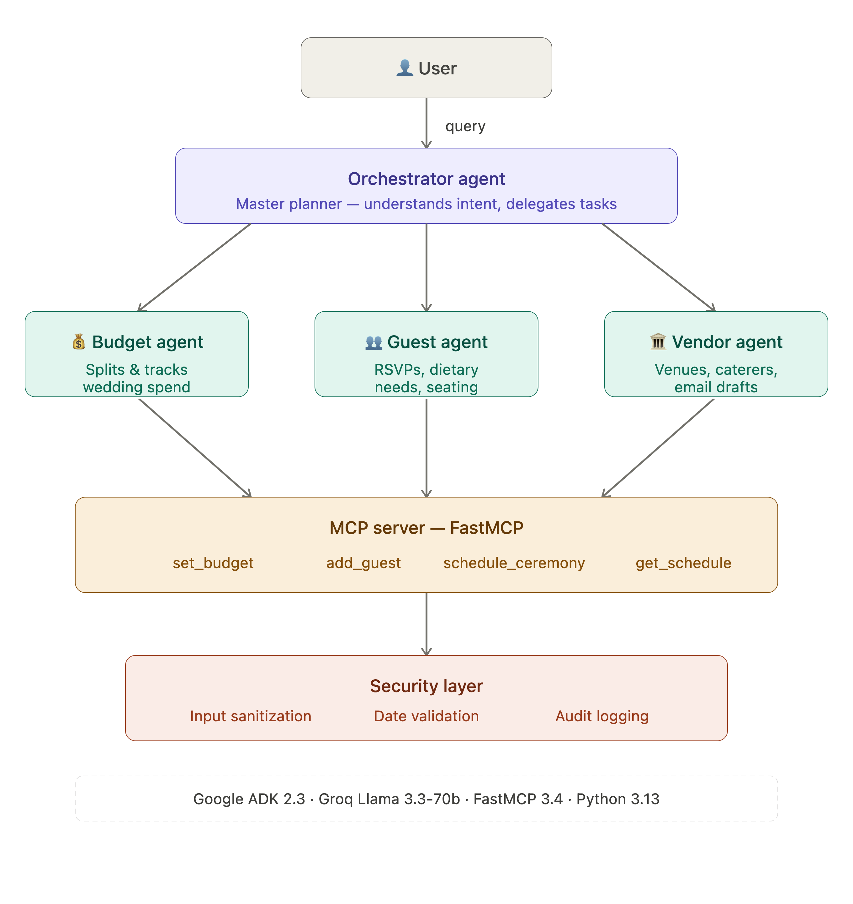

# AI Wedding Planner Agent

An intelligent multi-agent system for planning Indian weddings, built as part of the Kaggle AI Agents Capstone Competition (Concierge Agents track).

## The Problem

Planning an Indian wedding is genuinely overwhelming. You're coordinating vendors across multiple ceremonies, managing guest lists of 200-500 people with varying dietary needs, tracking a budget split across dozens of categories, and scheduling everything from the Mehendi to the Reception — often months in advance. Most couples either hire expensive wedding planners or spend hundreds of hours doing it manually.

This project explores whether an AI agent system can take on the coordination burden and give couples a single conversational interface to manage all of it.

## What It Does

The system uses four agents working together:

- **Orchestrator** — the entry point. Understands what the user is asking and routes it to the right sub-agent.
- **Budget agent** — takes a total budget and splits it across wedding categories. Tracks allocations and flags overspending.
- **Guest agent** — manages the guest list with RSVP status, dietary preferences, and family groupings.
- **Vendor agent** — suggests vendors by city and category, compares options, and drafts professional inquiry emails.

On top of this, a FastMCP server exposes four persistent tools — `set_budget`, `add_guest`, `schedule_ceremony`, and `get_wedding_schedule` — that the orchestrator can call directly. All inputs pass through a security layer that sanitizes strings, validates date formats, and logs anomalies.

## Architecture



## Tech Stack

- **Google ADK 2.3** — multi-agent orchestration and sub-agent delegation
- **Groq (Llama 3.3-70b-versatile)** — LLM backbone, accessed via LiteLLM
- **FastMCP 3.4** — MCP server exposing persistent wedding planning tools
- **Python 3.13** — core language

## Setup

### Prerequisites
- Python 3.10+
- A free Groq API key from [console.groq.com](https://console.groq.com)

### Installation

```bash
git clone https://github.com/mishra-prasoon/ai-wedding-planner-agent.git
cd ai-wedding-planner-agent
pip install -r requirements.txt
```

Create a `.env` file in the project root:

```
GROQ_API_KEY=your_groq_api_key_here
GOOGLE_GENAI_USE_VERTEXAI=FALSE
```

### Running

```bash
python3 main.py
```

The MCP server starts automatically in the background. You'll see a confirmation once it's connected, then the chat interface opens.

## Example Interactions

```
You: My wedding budget is 2000000. Split it across all categories.

You: Add guest: Priya Sharma, bride's sister, bride side, confirmed, vegetarian

You: Find me a photographer in Lucknow under 1.5 lakhs

You: Schedule my Sangeet on 2026-12-10 at 7:00 PM at Hotel Clarks Lucknow

You: Show me the full wedding schedule
```

## Project Structure

```
ai-wedding-planner-agent/
├── architecture.png 
├── main.py                  # Entry point and orchestrator setup
├── mcp_server.py            # FastMCP server with wedding planning tools
├── agents/
│   ├── budget_agent.py      # Budget allocation and tracking
│   ├── guest_agent.py       # Guest list management
│   └── vendor_agent.py      # Vendor search and communication
├── tools/
│   ├── calendar_tool.py     # Ceremony scheduling tools
│   └── security.py          # Input validation and sanitization
├── data/
│   └── wedding_config.json  # Sample wedding configuration
├── requirements.txt
└── .gitignore
```

## Security

User data (guest contacts, dietary preferences, personal details) never leaves the local session. The security module validates and sanitizes all inputs before they reach any tool or agent. Security events are logged locally to `wedding_planner_security.log`.

## Competition

Built for the [Kaggle AI Agents: Intensive Vibe Coding Capstone](https://kaggle.com/competitions/vibecoding-agents-capstone-project), Concierge Agents track.

Course concepts demonstrated:
- Multi-agent system with Google ADK
- MCP server integration (FastMCP)
- Security features (input validation, audit logging)
- Agent tool use (FunctionTool, MCPToolset)